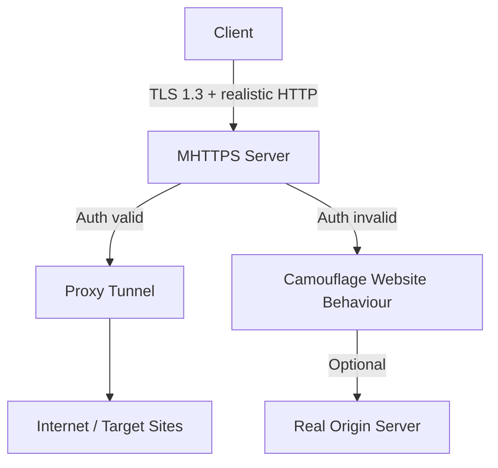
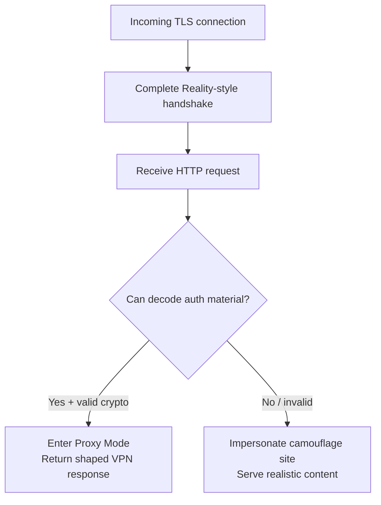

# MHTTPS Technical Specification & Design Report
**Patternless Unblockable Proxy Protocol**  
Version 0.3 – Hybrid Reality + Header-Steganography Design  
Target Environment: Great Firewall of China (GFW) and similar advanced DPI systems  
Date: 2026-07-24

---

## 1. Executive Summary

MHTTPS is a client-server proxy protocol designed to remain indistinguishable from ordinary HTTPS traffic to a legitimate high-traffic website. It combines three core techniques:

1. **Reality-style TLS camouflage** – Server borrows the TLS fingerprint and certificate behaviour of a real website.
2. **Request piggybacking with selective unlock** – Client embeds authentication material inside a fully plausible HTTP request. Server decodes a combination of headers + fields; valid decode → proxy mode, invalid → pure website impersonation.
3. **Aggressive traffic shaping & padding** – All requests and responses are forced into near-identical size/timing distributions so that statistical and ML classifiers cannot separate proxy flows from normal web traffic.

The result is that GFW active probes receive exactly the same response a normal visitor would receive, while authenticated clients obtain a full proxy tunnel. The design deliberately avoids systematic failure codes or unique TLS fingerprints that previous generations of circumvention tools produced.

---

## 2. Design Goals

| Goal                          | Priority | Success Metric                                      |
|-------------------------------|----------|-----------------------------------------------------|
| Defeat GFW active probing     | Critical | Probe always receives real-website behaviour        |
| Defeat passive DPI + ML       | Critical | No stable length/timing/header signature            |
| Indistinguishable from HTTPS  | Critical | JA3/JA4, ALPN, SNI, certificate match real site     |
| Reasonable performance        | High     | < 15 % overhead vs plain TLS                        |
| Simple client implementation  | Medium   | Can be built on top of existing TLS libraries       |
| Forward secrecy               | High     | Standard TLS 1.3 PFS preserved                      |

---

## 3. Threat Model (GFW-centric)

### 3.1 Adversary Capabilities
- Full passive observation of all packets leaving China.
- Active probing: after observing a suspicious flow, GFW connects to the same IP:port with crafted ClientHellos and HTTP requests.
- Machine-learning classifiers trained on length sequences, inter-arrival times, header entropy, TLS fingerprint, and long-term flow statistics.
- Ability to inject RSTs or black-hole IPs once a positive identification is made.
- Cannot break modern TLS 1.3 cryptography.

### 3.2 Assumptions
- Client and server share a long-term secret (or public-key material) out-of-band.
- Camouflage website is a real, high-volume site that supports TLS 1.3 and HTTP/2.
- Server IP is not already on a static blacklist.

---

## 4. High-Level Architecture

```
┌─────────────┐         TLS 1.3 (Reality camouflage)         ┌──────────────────┐
│   Client    │ ──────────────────────────────────────────► │  MHTTPS Server   │
│ (browser-   │   normal-looking HTTPS request               │                  │
│  like)      │   + embedded auth material                   │  ┌────────────┐  │
└─────────────┘                                              │  │ Auth Check │  │
                                                             │  └─────┬──────┘  │
                                                             │        │         │
                                                             │   valid?         │
                                                             │   ┌────┴────┐    │
                                                             │   │         │    │
                                                             │ Proxy    Website │
                                                             │ Mode     Fallback│
                                                             └──────────────────┘
```

- Outer layer: ordinary TLS connection to the camouflage SNI.
- Inner layer: after successful authentication, a full duplex proxy tunnel (can carry any TCP or UDP via multiplexing).

---

## 5. Protocol Components

### 5.1 TLS Camouflage Layer (Reality-inspired)

- Server is configured with a **dest** (camouflage) website, e.g. `www.microsoft.com`, `www.apple.com`, or a carefully chosen low-profile but high-traffic domain on the same ASN if possible.
- On every incoming TCP connection the server performs a normal TLS 1.3 handshake using parameters that match the dest site (cipher suites, extensions, certificate chain behaviour).
- The server’s own certificate is never presented to unauthenticated clients. Instead it either:
  - Proxies the real dest site’s responses, or
  - Serves a locally cached / generated realistic response that matches the dest site’s behaviour.
- Only after cryptographic authentication does the connection switch into proxy mode.

This eliminates the classic “server TLS fingerprint” that GFW historically used.

### 5.2 Request Piggybacking & Authentication

Client constructs a completely ordinary-looking HTTP/1.1 or HTTP/2 request that a real browser would send to the camouflage site.

Authentication material is embedded in a **combination** of the following fields (any subset may be used):

| Field                    | Example usage                                      | Notes |
|--------------------------|----------------------------------------------------|-------|
| Custom but plausible header | `X-Request-ID`, `X-Correlation-ID`, `Traceparent` | Must look like real tracing headers |
| Cookie value             | Session / analytics cookie                         | High entropy possible |
| Path or query parameter  | `/api/v2/telemetry?sid=...`                        | Must be a path the real site actually uses |
| User-Agent fine details  | Minor variations that still match a real browser   | Low entropy, use sparingly |
| Order / presence of headers | Specific sequence of standard headers            | Fragile – avoid as primary signal |

**Recommended strong method** (preferred over pure reversible encoding):

1. Client computes `token = HMAC-SHA256(shared_secret, timestamp || nonce || request_hash)`.
2. Token is placed in a field that the real site commonly uses for opaque values (e.g. a 32–64 byte cookie or header).
3. Server verifies the HMAC.  
   - Valid + fresh timestamp → unlock proxy mode.  
   - Invalid → fall through to website impersonation.

This gives cryptographic strength while still looking like ordinary web traffic.

### 5.3 Response Handling

| Condition                     | Server Action                                                                 | Visible to GFW / Probe |
|-------------------------------|-------------------------------------------------------------------------------|------------------------|
| Auth valid                    | Switch to proxy mode. Return data shaped as a normal HTTP response (status 200/204/304 or soft error). Real proxy payload is inside the encrypted TLS records. | Ordinary successful or mildly failed page load |
| Auth invalid / missing        | Act exactly as the camouflage website (proxy to real origin or serve realistic content). | Identical to a real visit |
| Malformed TLS / non-HTTP      | Close or respond as a normal web server would.                                | No special signal |

### 5.4 Padding & Traffic Shaping

To defeat length- and timing-based ML:

- Every request and response is padded to one of a small set of realistic size buckets derived from real traffic to the camouflage site.
- Padding is applied at the TLS record layer or inside the HTTP body (e.g. trailing whitespace, dummy JSON fields, or HTTP/2 DATA frames).
- Inter-packet timing is jittered to match measured distributions of the real site.
- Occasional decoy requests to the real camouflage domain are mixed in by the client.

---

## 6. Detailed Message Flow

```
Client                                          Server
  |                                               |
  |  TCP SYN                                      |
  |---------------------------------------------->|
  |                                               |
  |  ClientHello (uTLS fingerprint of real browser|
  |  + SNI = camouflage domain)                   |
  |---------------------------------------------->|
  |                                               |
  |                   ServerHello + Certificate   |
  |                   (matches real site)         |
  |<----------------------------------------------|
  |                                               |
  |  ... normal TLS 1.3 handshake ...             |
  |                                               |
  |  HTTP Request                                 |
  |  (realistic path, headers, cookies)           |
  |  + auth token embedded                        |
  |---------------------------------------------->|
  |                                               |
  |                    Auth check                 |
  |                    ├─ valid → Proxy mode      |
  |                    └─ invalid → Website mode  |
  |                                               |
  |  HTTP Response (shaped to look normal)        |
  |  (proxy data hidden inside encrypted body)    |
  |<----------------------------------------------|
  |                                               |
  |  Subsequent DATA frames / multiplexed streams |
  |  (still padded & shaped)                      |
  |<--------------------------------------------->|
```

---

## 7. Diagrams

### 7.1 Overall System View (Mermaid)



### 7.2 Authentication Decision Tree



### 7.3 Packet Appearance Comparison

| Observer sees                  | Normal HTTPS to microsoft.com | MHTTPS (authenticated) | MHTTPS (probe / unauthenticated) |
|--------------------------------|-------------------------------|------------------------|----------------------------------|
| SNI                            | microsoft.com                 | microsoft.com          | microsoft.com                    |
| JA3 / JA4                      | Chrome 126                    | Chrome 126 (uTLS)      | Chrome 126 (uTLS)                |
| Certificate                    | Real Microsoft chain          | Matches real           | Matches real                     |
| HTTP status distribution       | Mixed 200/301/404             | Mixed (shaped)         | Identical to real site           |
| Length sequence                | Realistic                     | Forced into same buckets | Identical                        |
| Active probe result            | Normal page                   | Normal page            | Normal page                      |

---

## 8. Security Analysis

### 8.1 Active Probing Resistance
Because every non-authenticated connection is answered exactly like the real camouflage website, the classic GFW probe (“does this speak the proxy protocol?”) returns a negative result. The IP is therefore not blacklisted on the basis of probe response.

### 8.2 Passive DPI / ML Resistance
- No unique TLS fingerprint.
- No systematic error-code signature.
- Length and timing distributions are forced to match the real site.
- Header combinations used for authentication are chosen from fields that already carry high entropy on the real site.

### 8.3 Remaining Risks
| Risk                              | Mitigation                                      | Residual Severity |
|-----------------------------------|-------------------------------------------------|-------------------|
| Over-used camouflage SNI          | Choose less popular but still high-volume sites | Medium            |
| Statistical residual after long observation | Dynamic padding + decoy traffic              | Low–Medium        |
| ClientHello fingerprint drift     | Keep uTLS profiles up to date                   | Low               |
| Server IP reputation              | Prefer clean / residential-like IPs             | Medium            |
| Implementation bugs in auth       | Use well-tested HMAC or public-key proofs       | Low (if careful)  |

---

## 9. Comparison with Existing Designs

| Feature                        | Classic Shadowsocks / VMess | Trojan          | VLESS + Reality | MHTTPS (this design) |
|--------------------------------|-----------------------------|-----------------|-----------------|----------------------|
| Active probe resistance        | Poor–Medium                 | Medium          | Excellent       | Excellent            |
| TLS fingerprint elimination    | No                          | Partial         | Yes             | Yes                  |
| Header / request steganography | Rare                        | Limited         | Optional        | Core mechanism       |
| Systematic failure signature   | Sometimes                   | No              | No              | Avoided              |
| Padding / shape control        | Plugin-dependent            | Limited         | Possible        | Mandatory            |
| Implementation complexity      | Low                         | Medium          | Medium–High     | High                 |

MHTTPS can be viewed as “Reality + mandatory realistic request piggybacking + enforced traffic shaping”.

---

## 10. Implementation Notes

### 10.1 Server
- Prefer Xray-core or a custom Go/Rust implementation that already supports Reality.
- Add a post-TLS HTTP parser that extracts the chosen auth fields before deciding the mode.
- Maintain a realistic response cache or reverse-proxy to the real camouflage origin for the fallback path.
- Apply padding at the TLS record or HTTP/2 frame layer.

### 10.2 Client
- Use uTLS (or equivalent) to generate browser-accurate ClientHellos.
- Construct HTTP requests that are byte-for-byte plausible for the chosen camouflage site.
- Embed the auth token in the designated field(s).
- After unlock, multiplex ordinary proxy traffic (SOCKS5, HTTP CONNECT, or native streams) inside the TLS connection.

### 10.3 Shared Secret Management
- Long-term pre-shared key or public-key pair distributed out-of-band.
- Rotate keys periodically; support multiple concurrent valid tokens.

### 10.4 Recommended Camouflage Site Selection Criteria
- Supports TLS 1.3 + HTTP/2
- High real traffic volume
- Not already heavily used by public Reality tutorials (avoid microsoft.com / apple.com defaults if possible)
- Ideally shares IP space or ASN characteristics with the server (harder for GFW to distinguish)

---

## 11. Limitations & Future Work

**Current limitations**
- Requires a stable camouflage site; if that site changes its behaviour dramatically the fallback path may become inconsistent.
- Pure header-based auth without cryptography is weaker; the design therefore mandates at least HMAC.
- Performance cost of padding and realistic request generation is non-zero.

**Future improvements**
- Multiple simultaneous camouflage SNIs with client-side random selection.
- Integration of XHTTP or gRPC transport on top of the Reality layer for additional multiplexing resistance.
- Automated measurement of real-site traffic distributions to keep padding buckets accurate.
- Formal side-channel analysis of the auth-token embedding fields.

---

## 12. Conclusion

The design is more complex than pure VLESS+Reality but gains an extra layer of request-level steganography and mandatory shape control. When implemented carefully it should offer state-of-the-art resistance against both active probing and passive statistical detection.

---

**Document status**: Living specification – iterate on auth field choices, padding distributions, and camouflage site selection as GFW behaviour evolves.

---

*End of MHTTPS Technical Specification v0.3*
```
